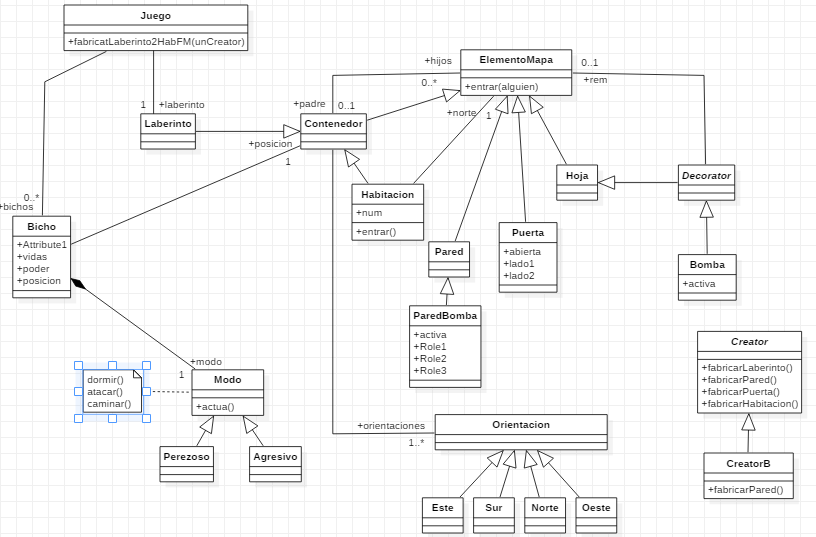
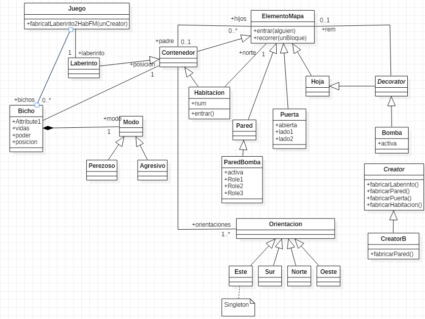
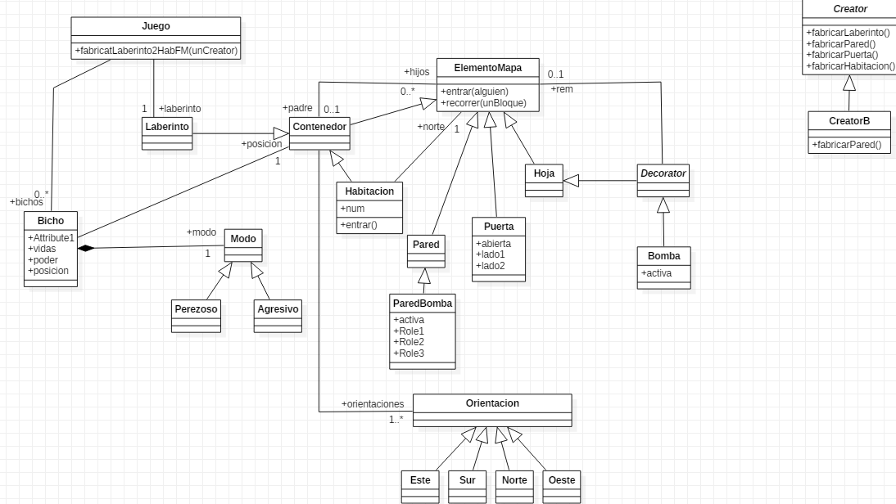
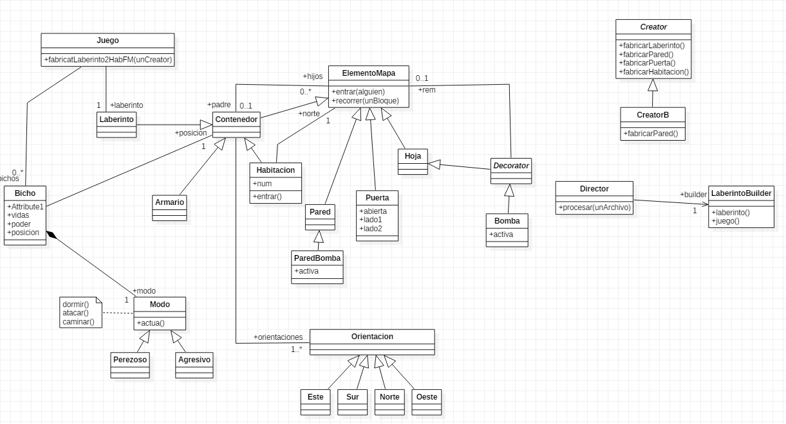
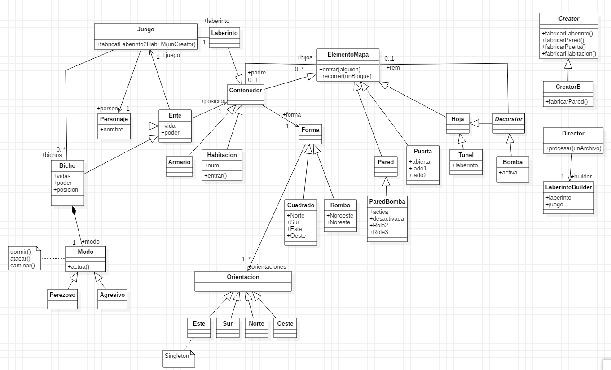
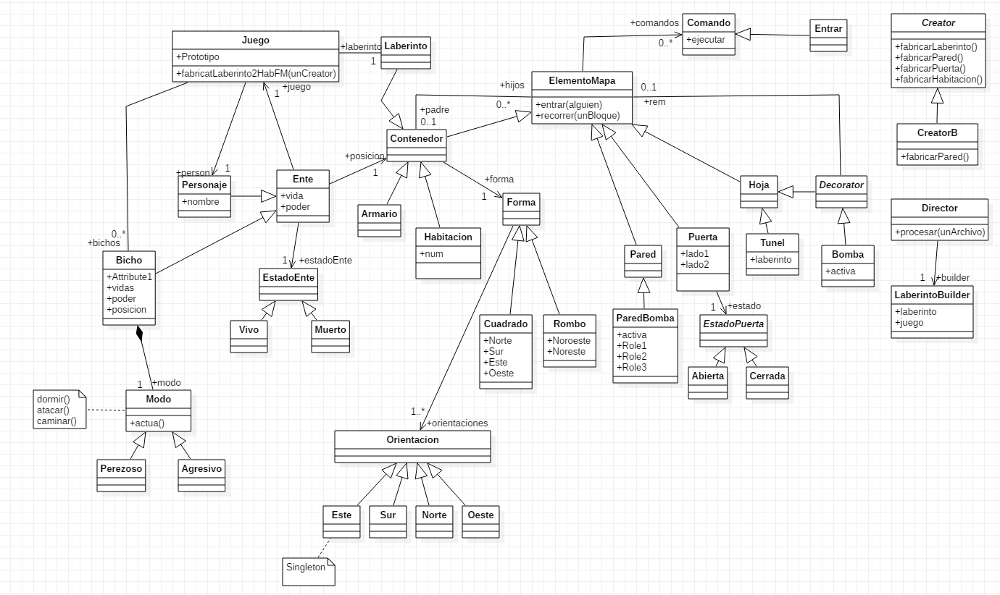
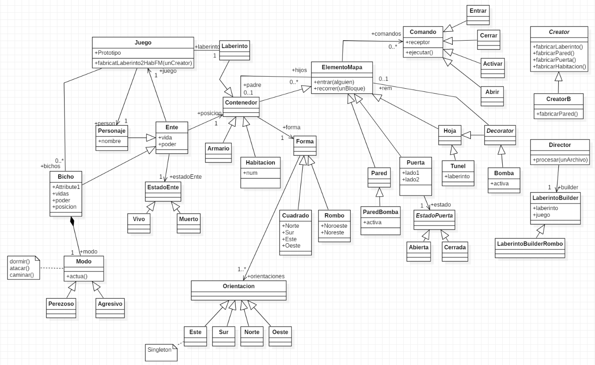
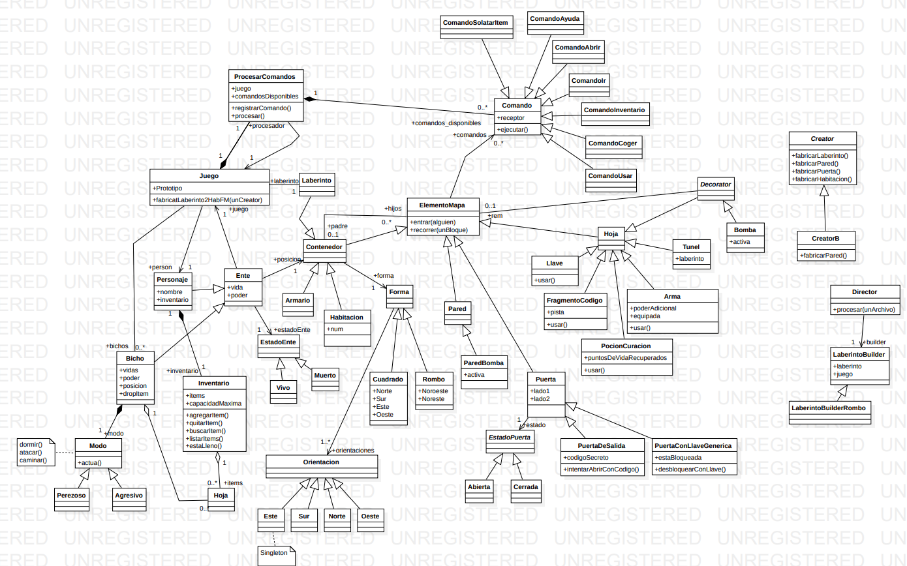

# Proyecto Laberinto - Diseño de Software

Este proyecto forma parte de la asignatura **Diseño de Software** y consiste en la implementación de un **laberinto** en Python, en el que las habitaciones están conectadas por puertas y separadas por paredes. A lo largo del desarrollo, se incorporan distintos patrones de diseño para mejorar la estructura y flexibilidad del código.

## Descripción  
El laberinto está compuesto por:  
- **Habitaciones** conectadas entre sí.  
- **Puertas y paredes**, que determinan los límites entre habitaciones.  
- **Elementos especiales**, como **paredes bomba** que pueden explotar y **enemigos** que dificultan el avance.

## Diagrama inicial

## Diagrama Composite
Compone objetos en una estructura de árbol para representar jerarquías todo-parte. El Composite permite que el cliente trate de manera uniforme tanto a objetos individuales como a objetos compuestos.

## Diagrama Decorator
Asigna dinámicamente responsabilidades adicionales a un objeto. Los 
decoradores proporcionan una alternativa flexible a la subclasificación para extender la funcionalidad. 

## Diagrama Strategy
Define una familia de algoritmos, encapsula cada uno en un objeto, de modo que son intercambiables. El Strategy permite cambiar el algoritmo sin que afecte al cliente. 

## Diagrama Template Method
Define el esqueleto de un algoritmo en una operación, dejando que las subclases definan algunos de los pasos. El Template Method deja que las subclases redefinan ciertos pasos de un algoritmo sin variar la estructura del algoritmo. 

## Diagrama Singleton
Asegura que una clase sólo tiene una instancia y proporciona un punto de acceso a la instancia

## Diagrama Iterator
Proporciona una forma de acceder secuencialmente a los elementos de 
un agregado (colección, conjunto, aggregate) sin exponer su implementación.
 

## Diagrama Builder
Separa la construcción de un objeto complejo de su representación, de modo que el mismo proceso de construcción se utiliza para crear diferentes representaciones. 
 

## Diagrama Proxy y Bridge
Proxy: Proporciona un sustituto o referencia a otro objeto para controlar el acceso a ese objeto.

Bridge: Desacopla una abstracción de su implementación de modo que las dos puedan variar de forma independiente.

## Diagrama State
Permite a un objeto alterar su comportamiento cuando cambia su estado interno. El objeto parecerá cambiar de clase. Reflejado en el diagrama en las calses EstadoEnte y EstadoPuerta.
 

## Diagrama Command
 Encapsula una petición como un objeto, permitiendo parametrizar a los clientes con diferentes peticiones y soportar operaciones deshacer. 
 

## Diagrama Proyecto Final
    Visión general de la estructura de clases del proyecto final. Detalla la organización de los elementos del juego, las entidades, el manejo de comandos por el usuario, el sistema de inventario y la construcción del mundo del juego.
    
