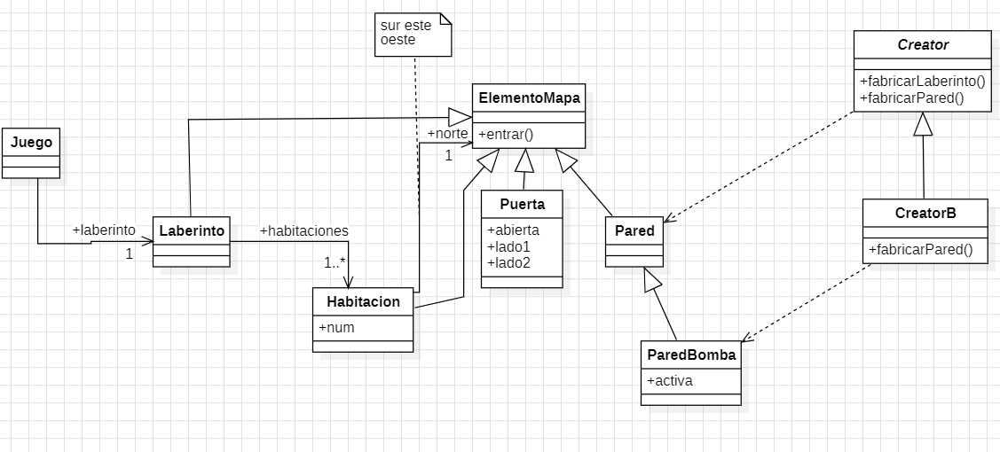
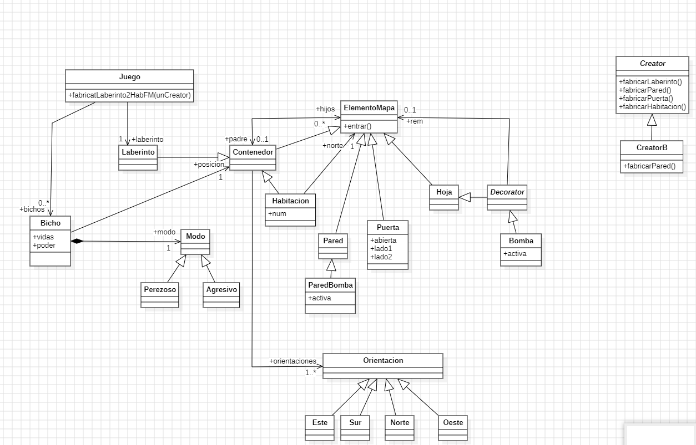
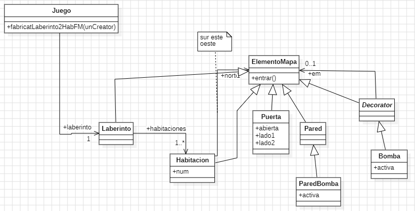
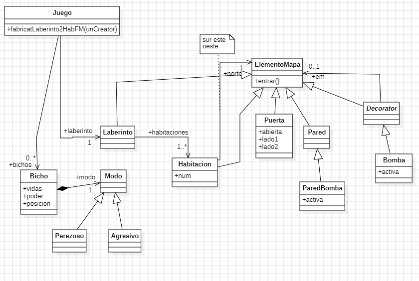

# Proyecto Laberinto - Diseño de Software

Este proyecto forma parte de la asignatura **Diseño de Software** y consiste en la implementación de un **laberinto** en Python, en el que las habitaciones están conectadas por puertas y separadas por paredes. A lo largo del desarrollo, se incorporan distintos patrones de diseño para mejorar la estructura y flexibilidad del código.

## Descripción  
El laberinto está compuesto por:  
- **Habitaciones** conectadas entre sí.  
- **Puertas y paredes**, que determinan los límites entre habitaciones.  
- **Elementos especiales**, como **paredes bomba** que pueden explotar y **enemigos** que dificultan el avance.

## Diagrama inicial

## Diagrama Composite

## Diagrama Decorator

## Diagrama Strategy

